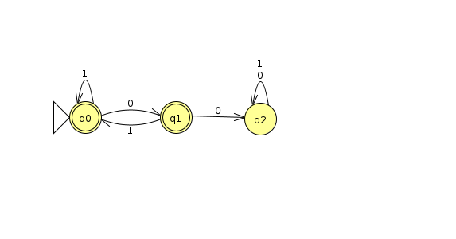
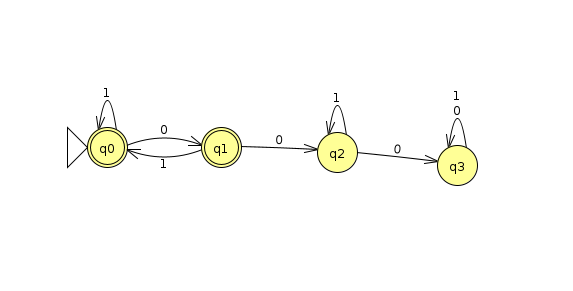
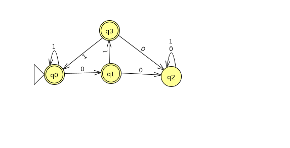
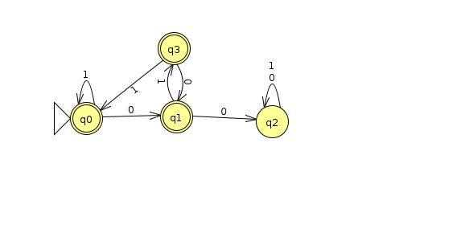
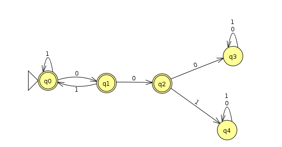

# Assignment A Regular Languages 1
## Larsen Close
### CS 3240 - Section 001

>These items are primarily to enable and encourage you to work directly with representations of regular languages in preparation for future work and upcoming exams. Use of JFLAP allows you to check the correctness of your work, enables exploration of operational behaviors of the formalisms, and provides a consistent means for sharing and assessment.

>The intended and recommended approach is as follows:

    Attempt each of the primary activities without reference to others' solutions or use of an automated computational tool (such as JFLAP).
    Develop a solution and a set of data that helps validate the solution.
    After you have deemed a solution satisfactory, implement that solution in JFLAP and use JFLAP's features to analyze and test your work.
    Clean up or annotate your solution as necessary for submission.

>This approach best prepares you for success on exams and putting this knowledge into practice.

### A1. Design a DFA for each of the following languages under the alphabet Σ = {0, 1}.

1.    a1dfa1.jff = { w | 00 is not a substring of w }
2.    a1dfa2.jff = { w | neither 00 nor 000 is a substring of w }
3.    a1dfa3.jff = { w | neither 00 nor 010 is a substring of w }
4.    a1dfa4.jff = { w | neither 00 nor 0100 is a substring of w }
5.    a1dfa5.jff = { w | neither 000 nor 001 is a substring of w }

>Implement each in JFLAP and upload the five corresponding JFLAP files using the specified filenames (a1dfa1.jff, a1dfa2.jff, etc.).

>Consider whether any of these languages are equivalent and separate these languages into groups (sets) that accept the same language.

>Use Online Text to indicate the groupings as equivalence sets; for example:
>{11a.jff, 11c.jff} {11b.jff} {11d.jff, 11e.jff}

### 1. a1dfa1.jff = { w | 00 is not a substring of w }
  (Q,Σ,delta,start,final)

    Q = { q0, q1, q2 }
    Σ = {0, 1}
    Delta
    start = { q0 }
    accept = { q0, q1 }
###### Delta
|Present State   | Next state for input 0   | Next state for input 1 |
|---|---|---|
|*q0| q1| q0|   
|*q1| q2| q1|   
|q2| q2| q2|

    equivalent to a1dfa2, a1dfa4

---

### 2.    a1dfa2.jff = { w | neither 00 nor 000 is a substring of w }
    (Q,Σ,delta,start,final)

    Q = { q0, q1, q2 }
    Σ = {0, 1}
    Delta
    start = { q0 }
    accept = { q0, q1 }

###### Delta
|Present State   | Next state for input 0   | Next state for input 1 |
|---|---|---|
|*q0| q1| q0|   
|q1| q2| q1|   
|q2| q2| q2|

    Equivalent to a1dfa1 If '00' is not a substring than '000' cannot be a substring

---

### 3.    a1dfa3.jff = { w | neither 00 nor 010 is a substring of w }
    (Q,Σ,delta,start,final)

    Q = { q0, q1, q2, q3 }
    Σ = {0, 1}
    Delta
    start = { q0 }
    accept = { q0, q1}

###### Delta
|Present State   | Next state for input 0   | Next state for input 1 |
|---|---|---|
|*q0| q1| q0|   
|q1| q2| q3|   
|q2| q2| q2|   
|q3| q2| q0|

---

### 4.    a1dfa4.jff = { w | neither 00 nor 0100 is a substring of w }
    (Q,Σ,delta,start,final)

    Q = { q0, q1, q2, q3 }
    Σ = {0, 1}
    Delta
    start = { q0 }
    accept = { q0, q1, q3}

###### Delta
|Present State   | Next state for input 0   | Next state for input 1 |
|---|---|---|
|*q0| q1| q0|   
|q1| q2| q3|   
|q2| q2| q2|   
|q3| q1| q0|

---

### 5.    a1dfa5.jff = { w | neither 000 nor 001 is a substring of w }
    (Q,Σ,delta,start,final)

    Q = { q0, q1, q2, q3 }
    Σ = {0, 1}
    Delta
    start = { q0 }
    accept = { q0, q1, q2}

###### Delta
|Present State   | Next state for input 0   | Next state for input 1 |
|---|---|---|
|*q0| q1| q0|   
|q1| q2| q0|   
|q2| q2| q2|   
|q3| q3| q3|

---

 ## A5. Define a right-linear grammar that generates:

> The language under the alphabet Σ = {0, 1} comprised of strings in which every 0 must have a 1 adjacent to it on both sides. Examples of strings that are accepted include 101, 1101, 1010101, and 1011101. Examples of rejected strings include 010, 0101, and 1001.

##### G = ({S, A, B}, {0, 1}, P, S)

    S → 1A
    A → 1A | 0B | 1 | λ
    B → 1A
