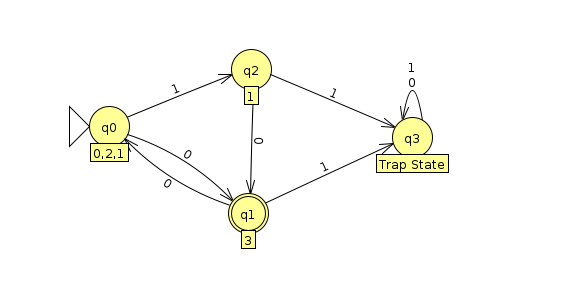

# Assignment A Regular Languages 1
## Larsen Close
### CS 3240 - Section 001
### Professor:  Dr Jody Paul.

>These items are primarily to enable and encourage you to work directly with representations of regular languages in preparation for future work and upcoming exams. Use of JFLAP allows you to check the correctness of your work, enables exploration of operational behaviors of the formalism, and provides a consistent means for sharing and assessment.

>The intended and recommended approach is as follows:

    Attempt each of the primary activities without reference to others' solutions or use of an automated computational tool (such as JFLAP).
    Develop a solution and a set of data that helps validate the solution.
    After you have deemed a solution satisfactory, implement that solution in JFLAP and use JFLAP's features to analyze and test your work.
    Clean up or annotate your solution as necessary for submission.

>This approach best prepares you for success on exams and putting this knowledge into practice.

### A1. Design a DFA for each of the following languages under the alphabet Σ = {0, 1}.

1.    a1dfa1.jff = { w | 00 is not a substring of w }
2.    a1dfa2.jff = { w | neither 00 nor 000 is a substring of w }
3.    a1dfa3.jff = { w | neither 00 nor 010 is a substring of w }
4.    a1dfa4.jff = { w | neither 00 nor 0100 is a substring of w }
5.    a1dfa5.jff = { w | neither 000 nor 001 is a substring of w }

>Implement each in JFLAP and upload the five corresponding JFLAP files using the specified filenames (a1dfa1.jff, a1dfa2.jff, etc.).

>Consider whether any of these languages are equivalent and separate these languages into groups (sets) that accept the same language.

>Use Online Text to indicate the groupings as equivalence sets; for example:
>{11a.jff, 11c.jff} {11b.jff} {11d.jff, 11e.jff}

#### 1. a1dfa1.jff = { w | 00 is not a substring of w }
    (Q,Σ,delta,start,final)

    Q = { q0, q1, q2 }
    Σ = {0, 1}
    Delta
    start = { q0 }
    accept = { q0, q1 }
###### Delta
|   Present State| Next state for input 0   | Next state for input 1 |
|---|---|---|
|→q0| q1| q0|   
|q1| q2| q1|   
|q2| q2| q2|

---

#### 2.    a1dfa2.jff = { w | neither 00 nor 000 is a substring of w }
    (Q,Σ,delta,start,final)

    Q = { q0, q1, q2 }
    Σ = {0, 1}
    Delta
    start = { q0 }
    accept = { q0, q1 }

###### Delta
|Present State   | Next state for input 0   | Next state for input 1 |
|---|---|---|
|→q0| q1| q0|   
|q1| q2| q1|   
|q2| q2| q2|

---

#### 3.    a1dfa3.jff = { w | neither 00 nor 010 is a substring of w }
    (Q,Σ,delta,start,final)

    Q = { q0, q1, q2, q3 }
    Σ = {0, 1}
    Delta
    start = { q0 }
    accept = { q0, q1}

###### Delta
|Present State   | Next state for input 0   | Next state for input 1 |
|---|---|---|
|→q0| q1| q0|   
|q1| q2| q3|   
|q2| q2| q2|   
|q3| q2| q0|

---

#### 4.  a1dfa4.jff = { w | neither 00 nor 0100 is a substring of w }
    (Q,Σ,delta,start,final)

    Q = { q0, q1, q2, q3 }
    Σ = {0, 1}
    Delta
    start = { q0 }
    accept = { q0, q1, q3, q4}

###### Delta
|Present State   | Next state for input 0   | Next state for input 1 |
|---|---|---|
|→q0| q1| q0|   
|q1| q2| q3|   
|q2| q2| q2|   
|q3| q1| q0|

---

#### 5. a1dfa5.jff = { w | neither 000 nor 001 is a substring of w }
    (Q,Σ,delta,start,final)

    Q = { q0, q1, q2, q3 }
    Σ = {0, 1}a1dfa1, a1dfa2, a1dfa4
    Delta
    start = { q0 }
    accept = { q0, q1, q2}

###### Delta

|   Present State| Next state for input 0   | Next state for input 1 |
|---|---|---|
| →q0 | q1 | q0 |   
|  q1 | q2 | q0 |   
|  q2 | q2 | q2 |   
|  q3 | q3 | q3 |

---
> #### Use Online Text to indicate the groupings as equivalence sets

  {a1dfa1.jff, a1dfa2.jff, a1dfa4.jff} {a1dfa4} {a1dfa5}

> #### Reflect on the experience of constructing these DFAs. Use Online Text to report observations related to your learning.

The assignment started off pretty smoothly then in talking with classmates there was a lot of disagreement and misunderstanding about whether we needed to take the complement of the strings not contained. It didn't really make sense to me that we could recognize it by negation unless it was by rejecting that and accepting everything else possible but with the confusion I wanted to check. Process wise I used this markdown format to keep notes and drew on a paper pad at first to brainstorm and then implemented within jflap to check on it. They're cool to work with, after you start doing it for a while you start to think totally differently.

---

## A2. Convert the following NFA into a DFA.

> ##### Implement the DFA using JFLAP and upload the DFA as a file named a2dfa.jff

| State   | 0 | 1  |
|---|---|---|
| →S | { q1, T} | q2 |   
| q1 | {S, T} | T |   
| q2 | T | T |    

| State   | 0 | 1  |
|---|---|---|
| →q0 | q1 | q2 |   
| q1 | q0| T |   
| q2 | q1 | T |    

> ##### Reflect.  Use Online Text to report observations related to your learning.

I am still working on getting the handle of using the tables and  transitions functions methodology for solving them. I understand what needs to happen and how to do so but not some of the methods for doing so seem more confusing that just doing it. I used tables just to kind of organize my thoughts but it seemed more complex to perform delta transition functions across the board d when it was relatively clear from looking at it how to do it. Something I need more practice with.

---
 ## A3
#### Finite automata are useful components of computers and algorithms, t---hus it is important to be able to minimize the number of states of a given DFA. Convert the following DFA to a minimum-state equivalent DFA.

##### Original

##### Minimized

> ##### Reflect.  Use Online Text to report observations related to your learning.

I immediately got an example of a case where it was a bit much for me to get my head around how to minimize this without using a specific method breaking into step by step or with tools to help. In looking at this one I thought that it would have an easier time writing it in minimal from based of the

---

### A4.
#### Consider the following regular grammar with start symbol S and terminals {x, y}.

    S → xS
    S → yX
    S → yY
    X → xX
    X → yS
    Y → xY
    Y → λ
##### A4a. List four strings, each of length less than 4, accepted by this grammar. (Include ε if it is accepted.)

1. S → yY → y                 (Y → λ)         'y'
2. S → yY → yxY → yx          (Y → λ)         'yx'
3. S → xS → xyY → xy          (Y → λ)         'xy'
4. S → yY → yxY → yxxY → yxx  (Y → λ)         'yxx'

##### A4b. List four strings, each of length less than 4, not accepted by this grammar. (Include ε if it is not accepted.)

1. 'ε'
2. 'x'
3. 'yy'
4. 'xx'

##### A4c. In English, describe the language represented by this grammar.

The language this represented by this grammar is made up of x's and y's, it does not contain the empty string, the only case within which it can have one letter is if that letter is y, all strings of greater than length one must contain at least one x and one y in either order.

---

 ### A5. Define a right-linear grammar that generates:

> The language under the alphabet Σ = {0, 1} comprised of strings in which every 0 must have a 1 adjacent to it on both sides. Examples of strings that are accepted include 101, 1101, 1010101, and 1011101. Examples of rejected strings include 010, 0101, and 1001.

##### G = ({S, A, B}, {0, 1}, P, S)
    p = {
      S → 1A | λ
      A → 0C | 1B | λ
      B → 1 | 1B | λ   
      C → 1B
    }

    S → 1A
    S → λ
    B → λ
    B → 0C
    A → 0C
    B → 1B
    A → 1B
    C → 1B

> ##### Implement that grammar in JFLAP and upload the implementation as a file named a5rg.jff

> ##### Reflect.  Use Online Text to report observations related to your learning.

We've been doing some of this in Principles of Programming languages which I am taking concurrently so I have relatively more experience here. I had no idea though how fast and powerful of method jflap was for creating/learning/experimenting with grammars. Well really across the board. I got it set up during the summer and messed with it a little bit but had no idea how helpful it and powerful for helping to develop an intuition of being able to think more in the way of a FA.
